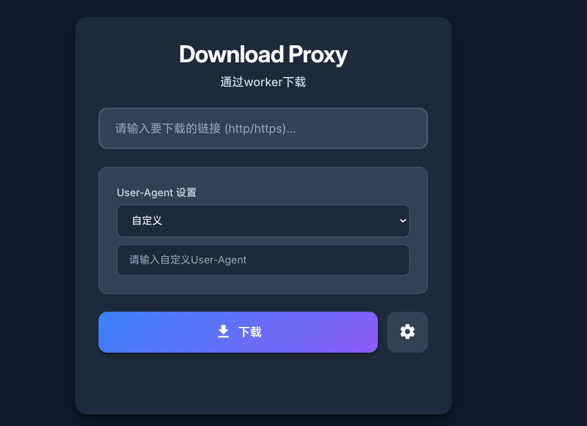
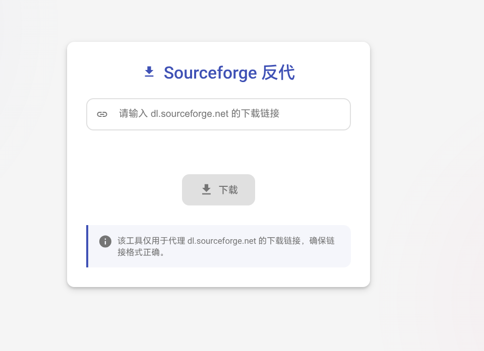

# Tips⚠
这里你所见到的所有代码均由 ai生成，并可以在Cloudflare Worker/Pages中部署，这个仓库只用来当作 备份，若你有修改的想法，请直接下载好后修改使用，这些脚本后期大概不会再更新

## 下载
- [Download-proxy.js](https://cdn.jsdelivr.net/gh/Fido6/tool-and-other-backup@main/Download-proxy.js) ：理论上通用的文件下载脚本，支持自定义请求UA

- [sourceforge-download-proxy.js](https://cdn.jsdelivr.net/gh/Fido6/tool-and-other-backup@main/sourceforge-download-proxy.js): 针对**Sourceforge**的下载，请尝试该脚本

